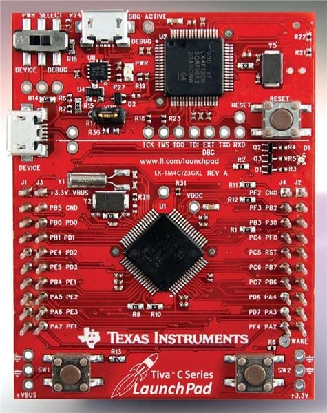

---
## Motivation
Recently I got interested into embedded programming and I decided to follow a course. The course ([course link](https://www.youtube.com/watch?v=hnj-7XwTYRI&list=PLPW8O6W-1chwyTzI3BHwBLbGQoPFxPAPM)) is a great introduction about embedded programming using the [Tiva™ C Series](https://www.ti.com/lit/ug/spmu296/spmu296.pdf?ts=1775651656826&ref_url=https%253A%252F%252Fwww.google.com%252F) dev board.



The instructor in the videos uses IAR as the IDE but also offers Keil as an alternative. He also recommends to use Windows to follow this course. After some episodes of this interesting course, I decided that I would give a try to break free from Keil's ecosystem and try to get an open-source alternative on Linux (Debian).

The environment is rather simple : *VSCodium* as the code editor, *GDB* + *OpenOCD* as the flasher/debugger, *GCC* with the correct toolchain as the compiler.

## Getting the right toolchain
We need the correct toolchain to be able to compile the C code for the correct architecture. The board is using an ARM micro controller therefore we will be using `arm-none-eabi`.

The reason we use this toolchain is because the micro controller is built using an ARM architecture and there is no OS on there (the 'none' part), so there is no library that comes with it to link to.

Install the toolchain and other required utils:
```
sudo apt install gcc-arm-none-eabi binutils-arm-none-eabi libnewlib-arm-none-eabi 
```

Then test the installation with :
```
arm-none-eabi-gcc --version
```

## Setting up the board
There are some files needed for the compiler. These are the following :
- A static library : a pre-compiled bundle of code that is baked directly into your final program file during the linking stage.
- A linker script : a configuration file that tells the linker exactly how to map your compiled code and data to the physical memory addresses (Flash and RAM) of your board/micro controller.


### The static library
Get TivaWare on https://www.ti.com/tool/SW-TM4C#downloads and unzip the .exe. 
```
unzip SW-EK-TM4C123GXL-2.2.0.295.exe
```
Inside there is a library we can compile to include during the compilation of the code.
```bash
#inside the unzipped file
make
```
Then get the file path for `driverlib/gcc/libdriver.a`.

This step will allow us to use the header files (gpio.h, rom.h, ...) from Texas Instrument and avoid directly doing bare-metal programming (however it could be more or less desirable for learning purposes).

### The linker script
The purpose of the linker script is so that the linker knows how to organize the memory after compiling. We can find a linker script for this board in the TivaWare

## GDB and OpenOCD
OpenOCD is a software tool that connects the computer to a microcontroller for flashing firmware and debugging hardware.
Let's install GDB along OpenOCD to be able to flash and debug some code. For `gdb` I use `gdb-multiarch` that also handles ARM as my computer is an x86-64.

First install OpenOCD :
```bash
sudo apt install openocd
```

We now need to find the configuration file to use with OpenOCD for this specific board. It can be found in `/usr/share/openocd/scripts/board/ti_ek-tm4c123gxl.cfg`. In this folder there are other configuration files for different boards as well.

## First program : blinky

For the test program, we will make a LED blink as seen in the course I am following. Here is the C code below.
```c
#define SYSCTL_RCGCGPIO_R      (*((volatile unsigned long *)0x400FE608))
#define GPIO_PORTF_DATA_R      (*((volatile unsigned long *)0x400253FC))
#define GPIO_PORTF_DIR_R       (*((volatile unsigned long *)0x40025400))
#define GPIO_PORTF_DEN_R       (*((volatile unsigned long *)0x4002551C))

int main(void) {
    //enable clock for Port F (Bit 5 of RCGCGPIO)
    SYSCTL_RCGCGPIO_R |= 0x20;

    volatile unsigned long delay = SYSCTL_RCGCGPIO_R;

    //set PF1 to red
    GPIO_PORTF_DIR_R |= 0x02;

    //enable PF1
    GPIO_PORTF_DEN_R |= 0x02;

    while(1) {
        GPIO_PORTF_DATA_R |= 0x02;  //on
        for(delay = 0; delay < 400000; delay++);
        
        GPIO_PORTF_DATA_R &= ~0x02; //off
        for(delay = 0; delay < 1000000; delay++);
    }
}
```
The code is self explainatory. All the raw addresses are picked from the datasheet by getting the base address and the offset in the GPIO memory map.

The Makefile is written as follows :
```Makefile
#replace this
TIVA_PATH = /home/hexo/Downloads/SW-TM4C-2.2.0.295

CC = arm-none-eabi-gcc
LD = arm-none-eabi-ld
OBJCOPY = arm-none-eabi-objcopy

# add -g for symbols and -Og for debug-friendly optimization
CFLAGS = -mthumb -mcpu=cortex-m4 -mfpu=fpv4-sp-d16 -mfloat-abi=hard \
         -Og -g -ffunction-sections -fdata-sections \
         -MD -std=c99 -Wall -I$(TIVA_PATH)
LDFLAGS = -T blinky.ld --entry ResetISR

all: main.bin

main.axf: main.o startup_gcc.o
	$(LD) $(LDFLAGS) -o main.axf main.o startup_gcc.o $(TIVA_PATH)/driverlib/gcc/libdriver.a

main.bin: main.axf
	$(OBJCOPY) -O binary main.axf main.bin

clean:
	rm -f *.o *.d *.axf *.bin

flash: main.bin
	openocd -f board/ti_ek-tm4c123gxl.cfg -c "program main.bin verify reset exit"

debug: main.bin
	openocd -f board/ti_ek-tm4c123gxl.cfg -c "program main.bin verify reset"
```
The flash target will simply flash the board using OpenOCD and exit right away, the code will run within the micro controller.

The debug target will hold OpenOCD to connect to it remotely using gdb. It is then possible to debug the program on-chip on real-time.
Here is a demo of it.


*Note : In gdb, the `openocd` command is an alias I made to `target remote :3333`*


## Wrap-up
With this minimal setup it is possible to write some code, compile it for the right architecture and debug the program on-chip. It might not be sufficient for a proper project but it will be enough to follow some crash-courses online.

## Sources
- [Modern Embedded Systems Programming](https://www.youtube.com/watch?v=hnj-7XwTYRI&list=PLPW8O6W-1chwyTzI3BHwBLbGQoPFxPAPM)
- [Tiva™ TM4C123GH6PM Microcontroller DATA SHEET](https://www.ti.com/lit/ds/symlink/tm4c123gh6pm.pdf)
- [Running (OpenOCD)](https://openocd.org/doc/html/Running.html)
